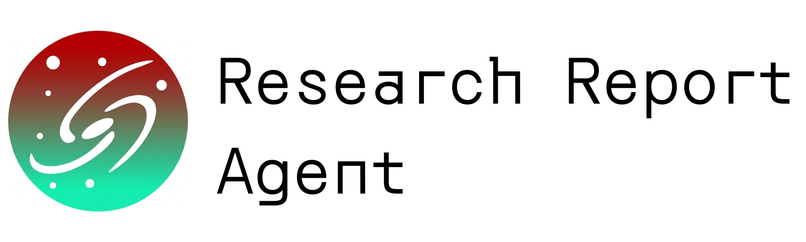
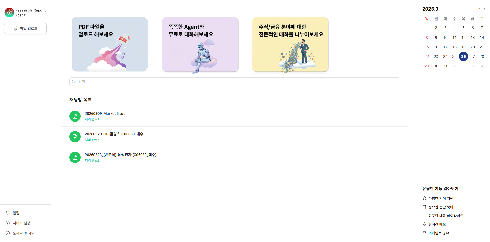
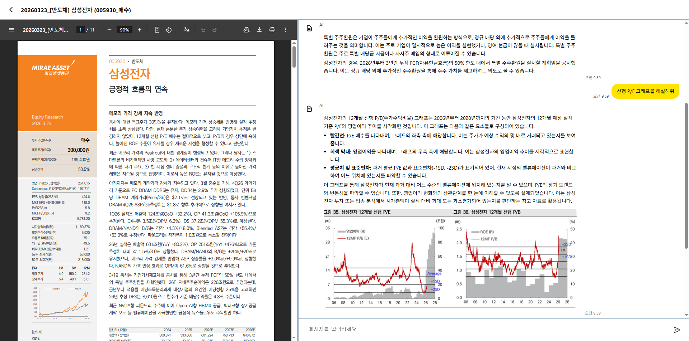
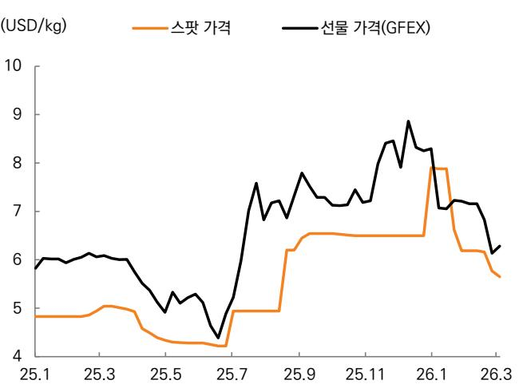
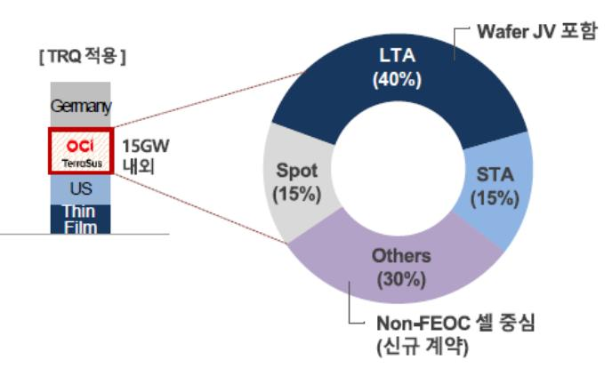
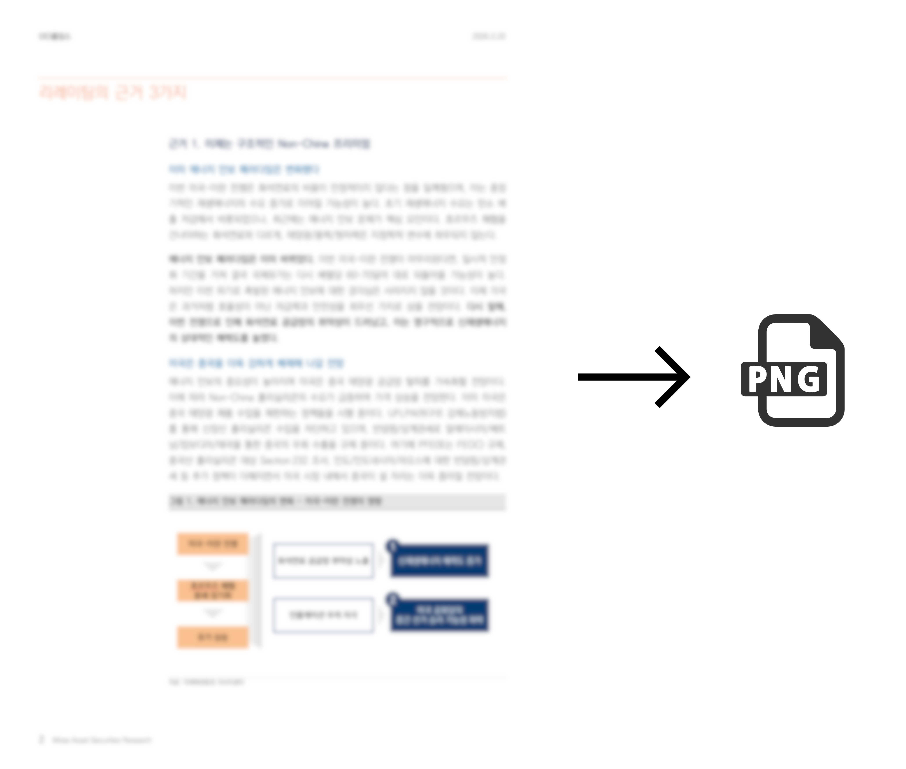
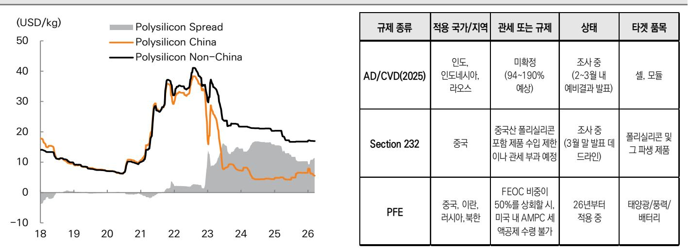
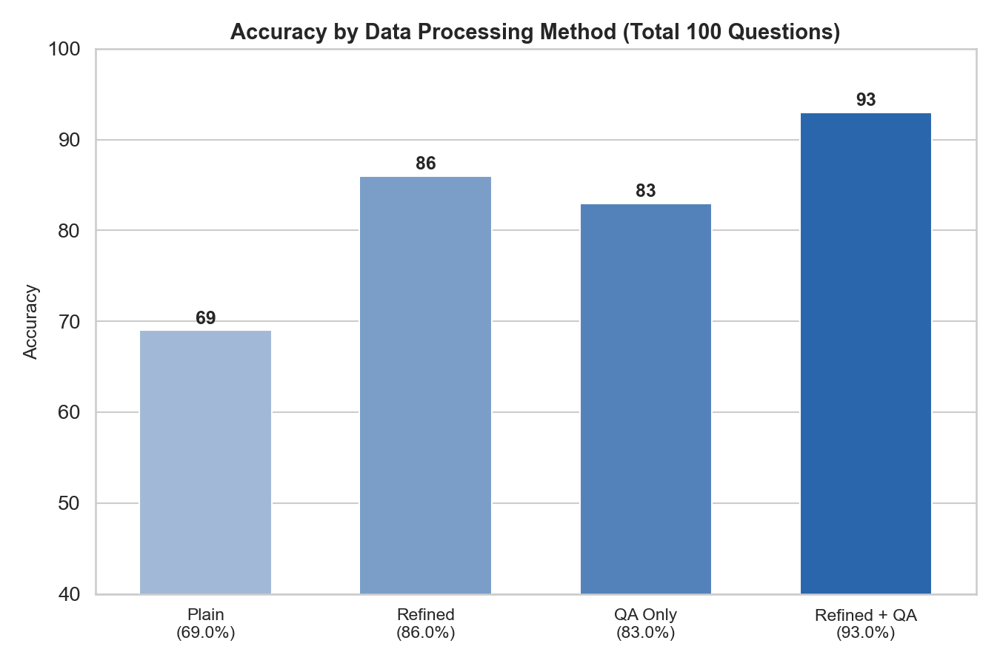

# Research_Report_Agent
증권사 기업분석, 투자분석 리서치 리포트 기반 MultiModal-RAG LLM Agent 서비스.
PDF 업로드부터 챗봇을 이용한 질의응답까지 전 과정을 자동화한 AI 파이프라인.



## Screenshot




## 목차
- [데이터 처리 파이프라인](#데이터-처리-파이프라인)
- [Evaluation](#evaluation)

## 기술 스택

**📊 Data** : 


**🤖 AI** : 


**🗄️ DB** : 


**⚙️ Backend** : 


**🎨 Frontend** : 


## Notes

### Special Requirements
1. tesseract <br> https://github.com/UB-Mannheim/tesseract/wiki
<br>C:\Program Files\Tesseract-OCR PATH 추가

2. poppler <br> https://github.com/oschwartz10612/poppler-windows/releases <br>
Library/bin/ 폴더 PATH에 추가

3. pip install <br> !pip install -U "unstructured[all-docs]" lxml pillow==9.5.0 pdf2image==1.16.3 layoutparser[layoutmodels,tesseract]==0.3.4

### 노트
정답 채점 시 반올림 한 것은 어떻게 해야할까? -> ㅇ. 정보를 찾았다는 뜻이기 때문.

QA 데이터 정체 성능평가: 정제, QA 따로 일때 알지 못했던 내용들을 잘 검색하는 성과를 보여줌.
틀린 문제의 절반은 십억원, 억원 등 액수 단위에 있어서의 오류였다. 이는 검색 자체는 올바르게 되었지만 더 넓은 문맥에서의 정보가 포함되지 않아 이해가 부족하다는 의미.

임베딩 모델 별 평가
? LLM 정제 데이터 + QA 합성 데이터 + 이미지 전저리 데이터 전부 다 vectordb 구성하면 **답변**퀄리티는 좋아진다. 하지만 정확한 측저을 해야 하는 임베딩 모델 평가 과정에서는 데이터 양이 너무 많아지면 특정한 하나의 문서를 찾아낼 확률이 급격히 낮아진다. 따라서 임베딩 모델에 따른 **검색 성능 평가**는 의도적으로 데이터 개수를 줄여서 진행한다.

점수 너무 낮은 이유 가설
1. 평가 매트릭 함수가 잘못됨. -> retriever의 k가 5로 설정되어있었음
2. 질문이 검색이 잘 안되도록 잘못 만들어짐.
3. doc이 너무 많아 검색이 제대로 될 리가 없음.

<br><br><br>

## 멀티모달 처리


## 멀티턴 처리


## 데이터 처리 파이프라인


**1. 이미지 추출**

Unstructured 패키지 사용해 데이터 시각화 차트 이미지 추출.
소형 노이즈 이미지 자동 필터링.



**2. PDF 데이터 추출**

PyMuPDF 사용해 pdf 전체 페이지 이미지 변환과 원본 텍스트 추출.




**3. 페이지 정제**

gpt-4.1 Vision API로 페이지 이미지를 참고해 페이지 구조를 파악하며 원본 텍스트를 정제.

일반 텍스트부터 복잡한 테이블과 그래프까지 데이터 손실 없이 평문화.


<table>
  <tr>
    <td valign="top">

### 정제 전

```python
투자의견(유지)  
매수 
목표주가(상향)  
▲ 270,000원 
현재주가(26/3/19) 
198,200원 
상승여력 
36.2% 
영업이익(25F,십억원) 
-58 
Consensus 영업이익(25F,십억원) 
- 
EPS 성장률(25F,%) 
적전 
MKT EPS 성장률(25F,%) 
36.0 
P/E(25F,x) 
- 
MKT P/E(25F,x) 
20.3 
KOSPI 
5,763.22 
시가총액(십억원) 
3,700 
발행주식수(백만주) 
19 
유동주식비율(%) 
69.3 
외국인 보유비중(%) 
19.4 
베타(12M) 일간수익률 
0.39 
52주 최저가(원) 
59,000 
52주 최고가(원) 
198,200 
(%) 
1M 
6M 
12M 
절대주가 
25.1 
103.9 
146.5 
상대주가 
23.3 
21.9 
12.4 
 
[에너지/정유화학] 
이진호 
jinho.lee.z@miraeasset.com 
```
  </td>
  
  <td valign="top">


### 정제 후
```python
투자의견(유지): 매수  
목표주가(상향): ▲ 270,000원  
현재주가(26/3/19): 198,200원  
상승여력: 36.2%  

영업이익(25F,십억원): -58  
Consensus 영업이익(25F,십억원): -  
EPS 성장률(25F,%): 적전  
MKT EPS 성장률(25F,%): 36.0  
P/E(25F,x): -  
MKT P/E(25F,x): 20.3  
KOSPI: 5,763.22  

시가총액(십억원): 3,700  
발행주식수(백만주): 19  
유동주식비율(%): 69.3  
외국인 보유비중(%): 19.4  
베타(12M) 일간수익률: 0.39  
52주 최저가(원): 59,000  
52주 최고가(원): 198,200  

(%)  
1M 절대주가: 25.1  
6M 절대주가: 103.9  
12M 절대주가: 146.5  
1M 상대주가: 23.3  
6M 상대주가: 21.9  
12M 상대주가: 12.4  

[에너지/정유화학]  
이진호  
jinho.lee.z@miraeasset.com  
```
  </td>
  
  </tr>
</table>


**4. QA 합성 데이터 생성**

gpt-4.1로 정제된 텍스트 데이터를 연속된 두 페이지씩 참고해 QA 형식의 합성 데이터 생성.

→ 페이지가 넘어가며 문맥이 잘리는 현상 방지.

→ 정제된 텍스트를 그대로 ChromaDB에 추가했을 때보다 검색 성능 증가.

```
Q1: OCI홀딩스가 일론 머스크와 협업할 가능성이 높다고 평가되는 이유와, 협업 시 예상되는 폴리실리콘 증설 규모는 어떻게 되나요?  
A1: OCI홀딩스가 일론 머스크와 협업할 가능성이 높다고 평가되는 주요 이유는 폴리실리콘 생산의 경제성과 미국 내 전력 인프라 상황에 있습니다. 폴리실리콘은 전력을 많이 소비하는 장치산업인데, 미국은 전력 비용이 높고 신규 전력 공급이 데이터센터에 우선 배정되어 폴리실리콘 공장을 미국에 짓는 것이 비효율적입니다. 반면, OCI홀딩스는 이미 전력이 저렴한 말레이시아에 부지를 확보하고 있어, 머스크와의 협업에 유리한 위치에 있습니다.  
협업이 성사될 경우, 폴리실리콘 공장 증설은 필수적입니다. 현재 OCI홀딩스의 연간 폴리실리콘 생산능력은 3.5만 톤(약 15~18GW 태양광 모듈 전환 가능)으로, 머스크가 계획 중인 미국 태양광 생산능력 200GW의 10%에도 미치지 못합니다. 과거 OCI홀딩스는 2027년까지 생산능력을 3.5만 톤에서 5.7만 톤까지 증설하겠다고 발표한 바 있어, 추가 증설도 충분히 가능할 것으로 전망됩니다.  
출처: ['page_5.png']

Q2: OCI홀딩스가 보유한 태양광/ESS 발전자산 파이프라인의 가치가 향후 어떻게 변화할 수 있으며, 그 근거는 무엇인가요?  
A2: OCI홀딩스가 보유한 총 7GW의 태양광/ESS 발전자산 파이프라인은 현재 약 1.1조 원(최근 매각 자산 가격 W당 10센트 초반, 환율 1,450원 적용)으로 평가됩니다. 그러나 글로벌 시장에서 유사 자산의 가치가 W당 1달러(예: 구글이 인수한 인터섹트의 태양광 파이프라인) 이상에 거래된 사례가 있어, 최대 10배 이상의 가치 상승 여력이 존재합니다. 이처럼 가치 차이가 발생하는 이유는 데이터센터에 대한 프리미엄, 개발 플랫폼 팀 포함 여부, 높은 PPA(전력구매계약) 체결 비율 등입니다. OCI홀딩스가 프로젝트 개발, 전력 공급, 데이터센터 인프라 제공 등으로 사업을 고도화할 경우, 현재 1.1조 원 수준의 파이프라인 가치가 수조 원대로 확대될 수 있습니다.  
출처: ['page_5.png']

Q3: 폴리실리콘에서 웨이퍼, 셀, 모듈까지 OCI홀딩스의 증설 계획은 어떻게 구성되어 있나요?  
A3: OCI홀딩스의 증설 계획은 폴리실리콘, 웨이퍼, 셀, 모듈 등 태양광 밸류체인 전반에 걸쳐 단계적으로 추진되고 있습니다. 구체적으로, 폴리실리콘은 2027년까지 생산능력을 5.7만 톤까지 확대할 계획이며, 웨이퍼는 2027년까지 5.4GW까지 증설할 예정입니다. 각 공정별로 가동 중인 설비와 2026년, 2027년 증설 예정 설비가 구분되어 있으며, 이를 통해 밸류체인 내 자체 소비처를 확보하고, 비(非)중국 공급망을 강화할 방침입니다.  
출처: ['page_4.png']

Q4: 미국 Section 232 조사결과 발표 시점이 지연될 수 있는 이유는 무엇이며, 실제 발표 시점은 언제로 예상되나요?  
A4: 미국 Section 232 조사결과 발표 시점은 규정상 3월 말까지로 예정되어 있으나, 2025년 11월 미국 정부의 셧다운 기간(43일)을 고려할 때 실제 발표가 4월 말까지 미뤄질 가능성이 있습니다. 셧다운 기간 동안 정부 업무가 중단되기 때문에, 공식적인 조사결과 발표 일정이 지연될 수 있는 것입니다.  
출처: ['page_4.png']

Q5: OCI홀딩스의 웨이퍼 사업 확장과 관련하여, 2027년까지 웨이퍼 증설이 완료될 경우 폴리실리콘 내수 소비 구조에 어떤 변화가 생기나요?  
A5: OCI홀딩스가 2027년까지 웨이퍼 증설을 5.4GW까지 완료할 경우, 약 1만 톤(총 폴리실리콘 생산능력의 30%)의 폴리실리콘을 자체적으로 소비할 수 있게 됩니다. 이는 웨이퍼 사업 진출로 인해 폴리실리콘의 안정적인 내수 소비처가 확보된다는 의미이며, 외부 시장 상황에 따른 판매 불확실성을 줄이고, 밸류체인 내에서의 수익성과 안정성을 동시에 높일 수 있습니다.  
출처: ['page_4.png']
```


**5. 이미지 설명 데이터 생성**

LLM에게 전체 pdf 페이지 이미지를 참고해 맥락을 파악하며 추출된 이미지를 설명하도록 요구.

→ QA 합성 데이터와 이미지 설명 데이터를 합쳐 **Chroma VectorDB**에 임베딩 저장.

→ **SQLite**에 pdf 파일 별 전처리 현황 업데이트로 사용자 UI에 진행 과정 알림.



```
## 이미지 콘텐츠
이 이미지는 2026년 3월 20일자 '미래에셋증권 리서치센터' 자료의 한 페이지를 일부 캡쳐한 것입니다. 전체 이미지는 폴리실리콘(태양광 핵심 원재료) 가격 및 관련 정책, 시장 환경 변화에 대해 분석하는 리포트의 일부입니다.

### 캡쳐된 일부 이미지 상세 설명

**이미지 맥락:**  
이 이미지는 전체 리포트 내 "그림 2. 폴리실리콘 가격 비교(China vs. Non-China) 추이"와 "그림 3. 추가 발표 예정인 미국의 중국 태양광 규제" 표 부분을 발췌한 것입니다.

<br>

#### 1. 그래프(좌측)
- **내용:**  
  2018년부터 2026년까지의 폴리실리콘 가격을 "중국(Polysilicon China)", "중국 외(Polysilicon Non-China)", 그리고 "가격 차이(Polysilicon Spread)"로 구분해 비교한 시계열 그래프입니다.
- **축:**  
  - \( x \)축: 연도(18~26)
  - \( y \)축: 폴리실리콘 가격(USD/kg)
- **의미:**  
  - 최근 몇 년 동안 폴리실리콘 가격이 급변했고, 중국과 중국 외 지역 간 가격 차이가 크게 확대되었음을 시각적으로 보여줍니다.
  - 2021~2023년 사이 중국 가격과 중국 외 가격 모두 급등했다가, 최근에는 중국 내 가격 급락과 함께 가격 차이가 크게 벌어지고 있음을 알 수 있습니다.
  
<br>

#### 2. 표(우측)
- **내용:**  
  미국이 2025년 이후 시행할 예정인 주요 중국 태양광 관련 규제 방안 세 가지(AD/CVD(2025), Section 232, PFE)의 세부내용을 요약한 표입니다.
- **항목:**  
  - 규제 종류
  - 적용 국가/지역
  - 관세 또는 규제 상세 내용
  - 현재 상태(조사 중 등)
  - 해당 품목(셀, 모듈, 폴리실리콘 및 그 파생 제품, 태양광/풍력/배터리 등)
- **의미:**  
  - 미국이 폴리실리콘 제품군 및 태양광 관련 전반 품목에 대해 다층적인 수입 규제를 본격 추진 중임을 알 수 있습니다.
  - 각 규제별 적용 대상국, 수입제한 방식, 조사 및 시행 일정 등이 정리되어 있어 향후 시장 가격 변동 등에 대한 근거자료로 활용할 수 있습니다.

---

**종합적으로 이 이미지는 최근 글로벌 폴리실리콘 시황과 미국의 주요 중국 태양광/폴리실리콘 수입 규제 정책이 가격에 미치는 영향을 동시에 시각화·정리한 자료임을 보여줍니다.**  
검색 결과로서 제공될 때, 폴리실리콘의 글로벌 가격 흐름과 주요 미국 규제 내용, 미래 시장 환경 변화 전망을 한눈에 파악할 수 있는 핵심 자료입니다.
출처: [/data\20260320_OCI홀딩스 (010060_매수)\fig\figure-3-5.jpg]

```

→ QA 합성 데이터와 이미지 설명 데이터를 합쳐 **Chroma VectorDB**에 임베딩 저장.

→ **SQLite**에 pdf 파일 별 전처리 현황 업데이트로 사용자 UI에 진행 과정 알림.

<br><br><br>

# 평가

## 데이터 전처리 방식에 따른 RAG 검색 성능평가

본 평가는 데이터 전처리 방식이 RAG 검색 성능에 미치는 영향을 분석하기 위해 진행하였다. Plain을 baseline으로 설정하고, LLM 기반 정제(Refined), QA 합성 데이터(QA Only), 두 방식의 결합(Refined + QA)방식으로 생성된 RAG 시스템의 검색 Accuracy를 측정하였다.


### 1. 정답지 생성

'20260320_OCI홀딩스 (010060_매수).pdf'를 사용해 RAG 시스템의 정확도를 판단할 수 있는 골든 셋 생성.

데이터 출처 : https://securities.miraeasset.com/bbs/download/2143307.pdf?attachmentId=2143307


### 2. 데이터 예시
정답-데이터 쌍은 다음 예시와 같이 숫자, 단답, 짧은 구절로 정답 유무를 명확히 구별할 수 있도록 100 건의 정답셋 제시.


| 질문 | 정답           |
|---|--------------|
| OCI홀딩스의 현재 투자의견은 무엇으로 제시되어 있나요? | 매수           |
| OCI홀딩스의 목표주가는 얼마로 상향 제시되었나요? | 270,000원     |
| 현재 주가 기준 상승여력은 몇 퍼센트로 제시되어 있나요? | 36.2%        |
| 12개월 선행 PER은 기존 몇 배에서 몇 배로 상향 적용되었나요? | 10배에서 20~50배 |
| 미국이 중국 신장산 폴리실리콘 수입을 차단하기 위해 적용 중인 법의 약칭은 무엇인가요? | UFLPA        |
| 미국이 중국산 폴리실리콘을 대상으로 진행 중인 조사의 명칭은 Section 몇 번 조사인가요? | Section 232  |
| 미국-이란 전쟁으로 인해 화석연료 공급망의 어떤 특성이 드러났다고 리포트에서 언급하나요? | 취약성          |
| 미국이 반덤핑·상계관세를 추가로 검토 중인 국가 중 하나로 언급된 남아시아 국가 이름은 무엇인가요? | 인도           |
| 2027년 예상 ROE는 몇 퍼센트로 제시되어 있나요? | 11.2%        |
| ... | ...          |


### 3. 평가 결과

각 수치는 각각의 방식으로 전처리한 데이터를 사용해 vector DB 구성 후 RAG 답변을 생성하여 정답과 대조한 Accuracy 값이다.




| 방식 | Accuracy (%) | 정답 수 / 전체 | Vector DB 구성 방식                                    |
|---|:---:|:---:|---------------------------------------------------- 
| Plain (Raw Text) | 69.0 | 69 / 100 | PyMuPDF로 pdf의 raw text를 추출          
| Refined (LLM 정제) | 86.0 | 86 / 100 | pdf 이미지와 텍스트를 LLM으로 정제한 데이터 사용          
| QA Only (QA 합성) | 83.0 | 83 / 100 | LLM으로 정제한 텍스트 데이터로부터 생성된 QA 합성 데이터만으로 구성 
| **Refined + QA (통합)** | **93.0** | **93 / 100** | LLM으로 정제한 텍스트 데이터와 QA 합성 데이터를 합쳐 구성      


| 통제 항목           | 설정값                            |
|-----------------|--------------------------------|
| LLM             | gpt-4.1                        |
| Embedding Model | OpenAI text-embedding-ada-002  |
| Text Splitter   | RecursiveCharacterTextSplitter |
| Chunk Size      | 500                       |
| Chunk Overlap   | 100                         |
| Temperature     | 0                           |
| Vector DB       | Chroma DB                      |
| 평가 문항 수         | 100 문항                     |

### 4. 결과

> Refined 데이터와 QA 합성 데이터를 통합하여 구성한 Vector DB는 93%의 Accuracy를 달성하였으며, 이는 Refined 단독 대비 **+7%p**, Plain 대비 **+24%p** 향상된 수치이다. 두 데이터 소스가 검색 커버리지 측면에서 상호 보완적으로 작용함을 알 수 있다.

### 5. 개선점 

| 오류 유형                   | 건수 | 설명                        |
|-------------------------|:--:|---------------------------|
| 단위 혼동 (십억원 / 억원)        | 3건 | 검색은 성공했으나 넓은 맥락 부재로 단위 오류 |
| 검색 실패 (Retrieval Miss)  | 1건 | 관련 청크가 검색되지 않은 경우         |
| 값 오류 (Generation Error) | 3건 | 잘못된 값을 결과값으로 출력한 경우       |


