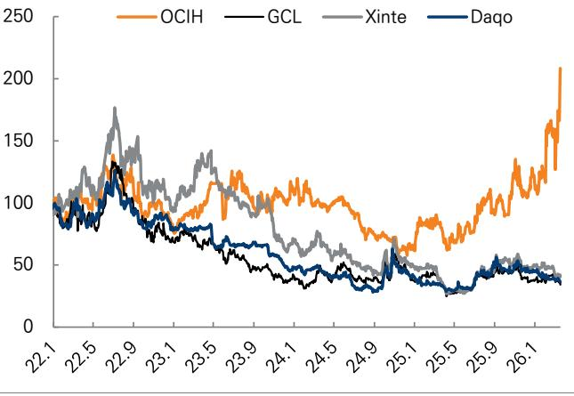
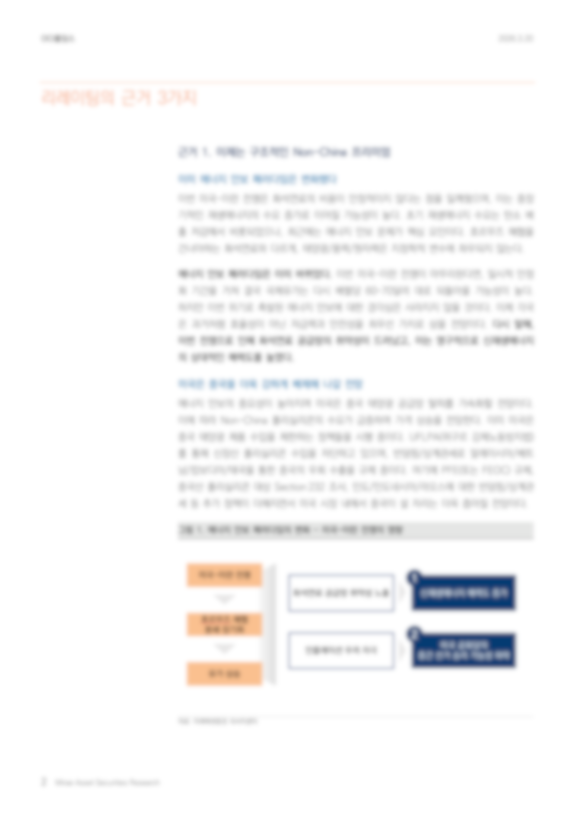

# Research_Report_Agent
증권사 기업분석, 투자분석 리서치 리포트 기반 MultiModal-RAG LLM Agent 서비스.
PDF 업로드부터 챗봇을 이용한 질의응답까지 전 과정을 자동화한 AI 파이프라인.

--이미지

## Screenshot


## Note

여러가지 개발하며 노트 했던거

##데이터 처리 파이프라인


**1. 이미지 추출**

Unstructured 패키지 사용해 데이터 시각화 차트 이미지 추출.
소형 노이즈 이미지 자동 필터링.

                    

**2. PDF 데이터 추출**

PyMuPDF 사용해 pdf 전체 페이지 이미지 변환과 원본 텍스트 추출.




**3. 페이지 정제**

gpt-4.1 Vision API로 페이지 이미지를 참고해 페이지 구조를 파악하며 원본 텍스트를 정제.

일반 텍스트부터 복잡한 테이블과 그래프까지 데이터 손실 없이 평문화.


<table>
  <tr>
    <td valign="top">

### 정제 전

```python
투자의견(유지)  
매수 
목표주가(상향)  
▲ 270,000원 
현재주가(26/3/19) 
198,200원 
상승여력 
36.2% 
영업이익(25F,십억원) 
-58 
Consensus 영업이익(25F,십억원) 
- 
EPS 성장률(25F,%) 
적전 
MKT EPS 성장률(25F,%) 
36.0 
P/E(25F,x) 
- 
MKT P/E(25F,x) 
20.3 
KOSPI 
5,763.22 
시가총액(십억원) 
3,700 
발행주식수(백만주) 
19 
유동주식비율(%) 
69.3 
외국인 보유비중(%) 
19.4 
베타(12M) 일간수익률 
0.39 
52주 최저가(원) 
59,000 
52주 최고가(원) 
198,200 
(%) 
1M 
6M 
12M 
절대주가 
25.1 
103.9 
146.5 
상대주가 
23.3 
21.9 
12.4 
 
[에너지/정유화학] 
이진호 
jinho.lee.z@miraeasset.com 
```
  </td>
  
  <td valign="top">


### 정제 후
```python
투자의견(유지): 매수  
목표주가(상향): ▲ 270,000원  
현재주가(26/3/19): 198,200원  
상승여력: 36.2%  

영업이익(25F,십억원): -58  
Consensus 영업이익(25F,십억원): -  
EPS 성장률(25F,%): 적전  
MKT EPS 성장률(25F,%): 36.0  
P/E(25F,x): -  
MKT P/E(25F,x): 20.3  
KOSPI: 5,763.22  

시가총액(십억원): 3,700  
발행주식수(백만주): 19  
유동주식비율(%): 69.3  
외국인 보유비중(%): 19.4  
베타(12M) 일간수익률: 0.39  
52주 최저가(원): 59,000  
52주 최고가(원): 198,200  

(%)  
1M 절대주가: 25.1  
6M 절대주가: 103.9  
12M 절대주가: 146.5  
1M 상대주가: 23.3  
6M 상대주가: 21.9  
12M 상대주가: 12.4  

[에너지/정유화학]  
이진호  
jinho.lee.z@miraeasset.com  
```
  </td>
  
  </tr>
</table>


**4. QA 합성 데이터 생성**

gpt-4.1로 정제된 텍스트 데이터를 연속된 두 페이지씩 참고해 QA 형식의 합성 데이터 생성.

→ 페이지가 넘어가며 문맥이 잘리는 현상 방지.

→ 정제된 텍스트를 그대로 ChromaDB에 추가했을 때보다 검색 성능 증가.

**5. 이미지 설명 데이터 생성**

LLM에게 전체 pdf 페이지 이미지를 참고해 맥락을 파악하며 추출된 이미지를 설명하도록 요구.

→ QA 합성 데이터와 이미지 설명 데이터를 합쳐 **Chroma VectorDB**에 임베딩 저장.

→ **SQLite**에 pdf 파일 별 전처리 현황 업데이트로 사용자 UI에 진행 과정 알림.


# 성능비교

성능비교 표 추가
