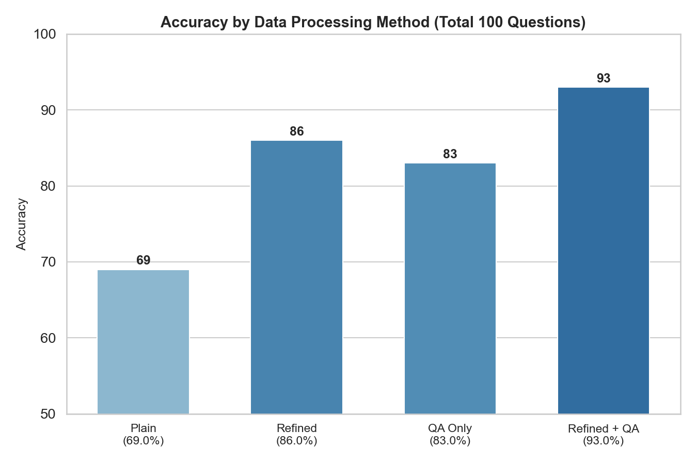
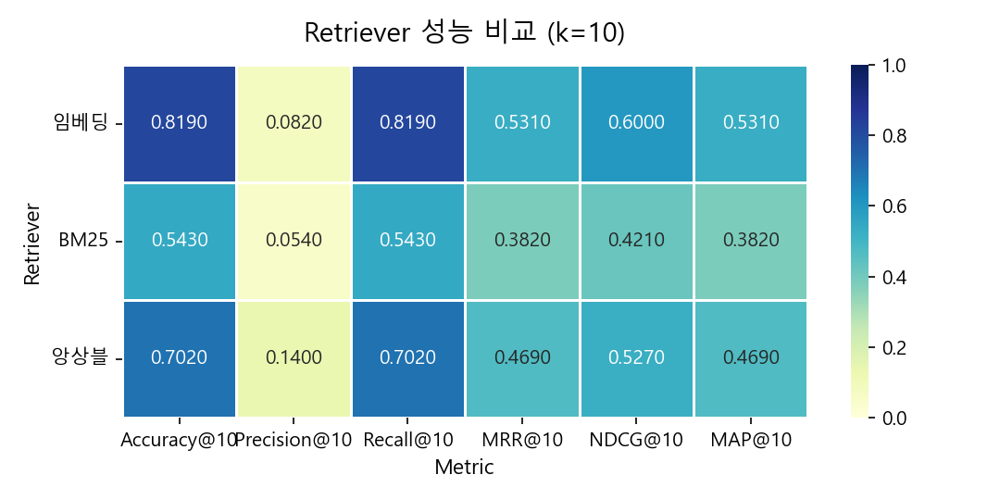

# Research_Report_Agent
증권사 기업분석, 투자분석 리서치 리포트 기반 MultiModal-RAG LLM Agent 서비스.  
PDF 업로드부터 챗봇을 이용한 질의응답까지 전 과정을 자동화한 AI 파이프라인.

# 📝Index
- [📷Screenshot](#screenshot)
- [🎯Stacks](#stacks)
- [💎Implementation Details](#implementation-details)
  - [Data Processing Pipeline](#Data-Processing-Pipeline)
  - [Evaluation](#evaluation)
    - [데이터 전처리 방식에 따른 RAG 검색 성능평가](./evaluation_data_processing_method/README.md)
    - [임베딩 모델에 따른 RAG 검색 성능평가](./evaluation_embedding_model/README.md)
  - [Multimodal & Multiturn](#multimodalmultiturn)

   

# 📸Screenshot

   

## 🎯Stacks

**Data** : 

**AI** : 

**Database** : 

**Backend** : 

**Frontend** : 

 

### Special Requirements
1. tesseract   https://github.com/UB-Mannheim/tesseract/wiki
 C:\Program Files\Tesseract-OCR PATH 추가

2. poppler   https://github.com/oschwartz10612/poppler-windows/releases  
Library/bin/ 폴더 PATH에 추가

3. pip install   
`!pip install -U "unstructured[all-docs]" lxml pillow==9.5.0 pdf2image==1.16.3 layoutparser[layoutmodels,tesseract]==0.3.4`

   

# 💎Implementation Details

## Data Processing Pipeline

### - [데이터 처리 파이프라인](./README_data_pipeline.md)

 

## Evaluation

### - [데이터 전처리 방식에 따른 RAG 검색 성능평가](./evaluation_data_processing_method/README.md)

### - [임베딩 모델에 따른 RAG 검색 성능평가](./evaluation_embedding_model/README.md)

 

## Multimodal&Multiturn

### - [MultiModal & Multiturn](./README_multi.md)

      

---

Notes

정답 채점 시 반올림 한 것은 어떻게 해야할까? -> ㅇ. 정보를 찾았다는 뜻이기 때문.

QA 데이터 정체 성능평가: 정제, QA 따로 일때 알지 못했던 내용들을 잘 검색하는 성과를 보여줌.
틀린 문제의 절반은 십억원, 억원 등 액수 단위에 있어서의 오류였다. 이는 검색 자체는 올바르게 되었지만 더 넓은 문맥에서의 정보가 포함되지 않아 이해가 부족하다는 의미.

임베딩 모델 별 평가
? LLM 정제 데이터 + QA 합성 데이터 + 이미지 전저리 데이터 전부 다 vectordb 구성하면 **답변**퀄리티는 좋아진다. 하지만 정확한 측저을 해야 하는 임베딩 모델 평가 과정에서는 데이터 양이 너무 많아지면 특정한 하나의 문서를 찾아낼 확률이 급격히 낮아진다. 따라서 임베딩 모델에 따른 **검색 성능 평가**는 의도적으로 데이터 개수를 줄여서 진행한다.

점수 너무 낮은 이유 가설
~~1. 평가 매트릭 함수가 잘못됨. -> retriever의 k가 5로 설정되어있었음~~
~~2. 질문이 검색이 잘 안되도록 잘못 만들어짐.~~
~~3. doc이 너무 많아 검색이 제대로 될 리가 없음.~~

임베딩 모델의 크기 -> bge-m3, OpenAI large model 성능 측정

