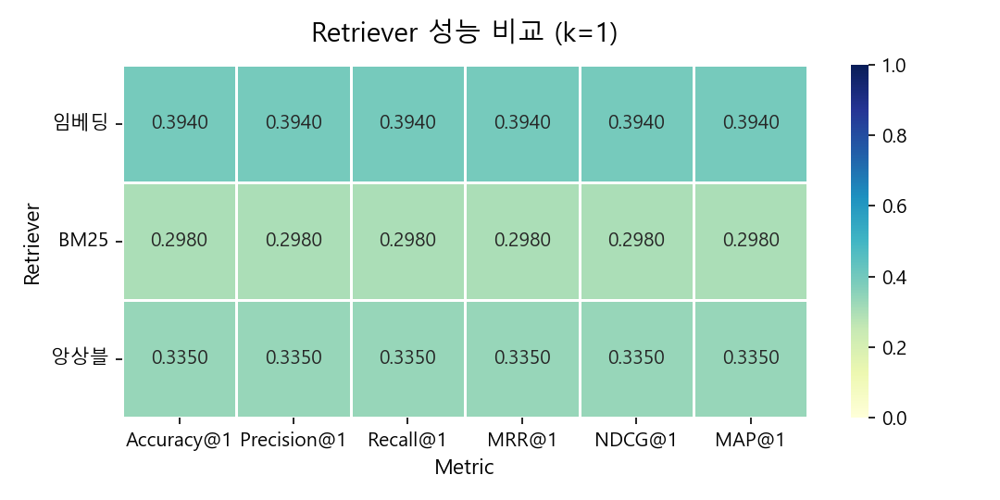
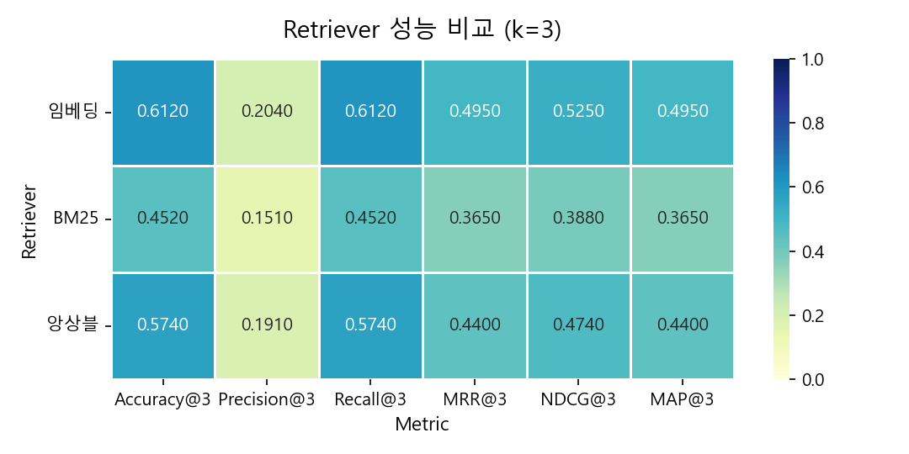
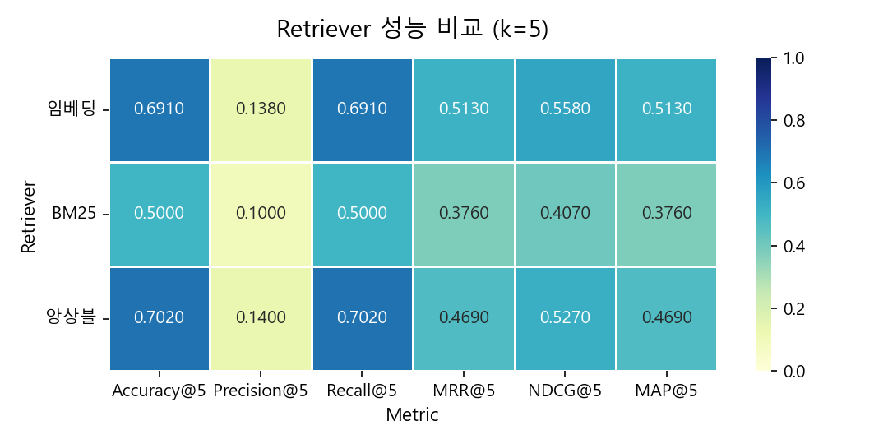
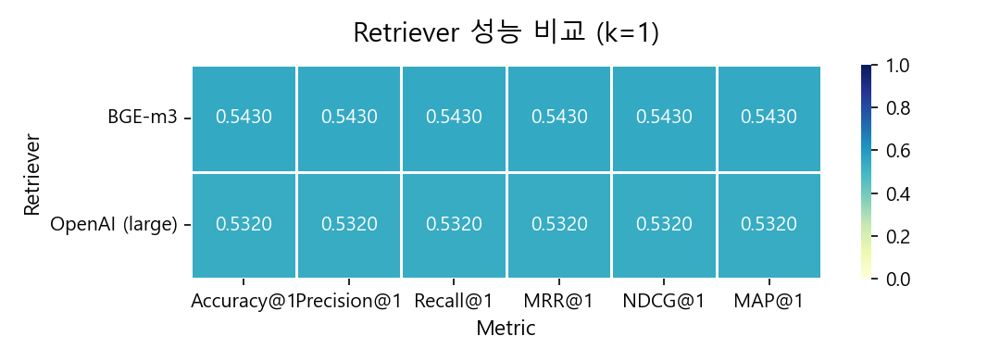
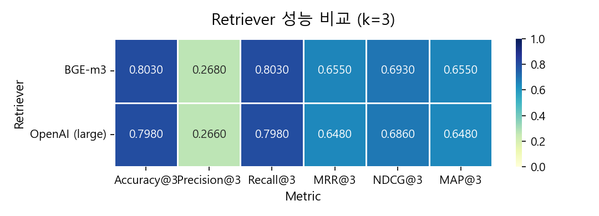
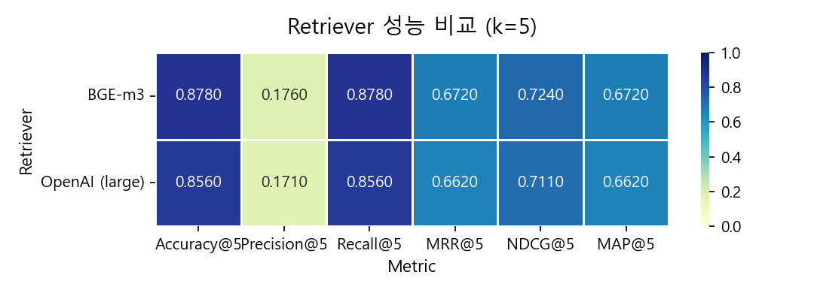
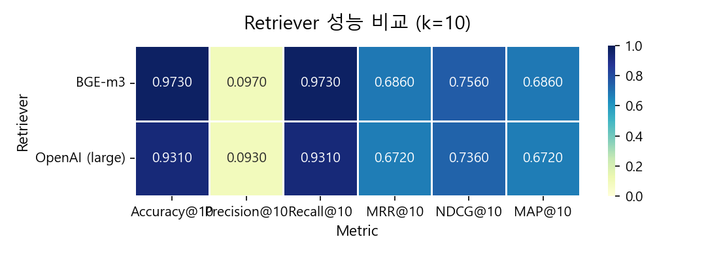

# 임베딩 모델에 따른 RAG 검색 성능 평가

### 개요

RAG 시스템의 검색, 답변 품질 향상을 위해 VectorDB를 구성하는 임베딩 모델 및 검색 알고리즘에 따른 Retriever 성능을 평가했다.
OpenAI Embedding Model (text-embedding-ada-002, text-embedding-3-large), BGE-m3, Ensemble, BM25로 총 5가지의 Retriever를 동일한 평가 데이터셋을 사용해 성능을 비교했다.

### 비교 Retriever

| # | Retriever | 방식     |
|---|---|--------|
| 1 | OpenAI text-embedding-ada-002 | Dense |
| 2 | BM25 | Sparse|
| 3 | Ensemble (ada-002 : BM25 = 5:5) | Hybrid|
| 4 | OpenAI text-embedding-3-large | Dense |
| 5 | BAAI/BGE-m3 | Dense |

### 데이터셋

- **소스**: 미래에셋증권 기업분석 리포트 `20260402_신세계(004170_매수).pdf` <br> https://securities.miraeasset.com/bbs/download/2143555.pdf?attachmentId=2143555
- **전처리**: LLM 기반 텍스트 정제 + QA 합성 데이터 + 이미지 설명 데이터 -> 총 94개 Corpus
- **Query 생성**: 각 Corpus 실사용자 질문 패턴을 모사한 질문을 LLM으로 2개씩 생성 → 총 188개 Query
- **Relevant Docs**: Query별 정답 문서 ID를 1:1 매핑하여 `relevant_docs.json`으로 관리

데이터 예시

```
"q_29_1": "신세계DF의 2025년과 2026년 연간 매출액 성장률을 비교해 보세요. 어떤 변화가 있었나요?",
"q_30_0": "신세계DF의 매출 성장률 추세는 어떻게 변했나요?",
... 188개
```

```
"c34a6511-0601-4621-8c7f-3af47e45848f": "### 좌측 테이블\n\n- **투자의견(유지)**: 매수\n- **목표주가(상향)**: 450,000원\n- **현재주가(26/4/1)**: 316,500원\n- **상승여력**: 42.2%\n\n#### 영업이익(26F, 십억원)\n- [컨센서스(영업이익/26F, 십억원)] 640\n\n#### EPS 성장률(26F, %)  \n- 1,904.7\n\n#### MKT EPS 성장률(26F, %)  \n- 136.0\n\n#### P/E(26F, x)  \n- 10.1\n\n#### MKT P/E(26F, x)  \n- 10.4\n\n#### KOSPI  \n- 5,478.70\n\n#### 시가총액(26/4/1, 억원)  \n- 3,053\n\n#### 동일업종 시가총액(26/4/1, 억원)  \n- 59,090\n\n#### 유통주식수(백만주)  \n- 6.1\n\n#### 외국인 보유비중(%)  \n- 20.7\n\n#### 배당(12M) 주가수익률(%)  \n- 1.90\n\n#### 52주 최저가(원)  \n- 135,400",
"3ab0be03-d8ec-4817-a650-966159175266": "#### 외국인 보유비중(%)  \n- 20.7\n\n#### 배당(12M) 주가수익률(%)  \n- 1.90\n\n#### 52주 최저가(원)  \n- 135,400\n\n#### 52주 최고가(원)  \n- 376,500\n\n#### (%)  \n- 절대주가(1M, 6M, 12M)  \n  - -14.1, 7.2, 13.2  \n- 상대주가  \n  - -2.1, 8.9, 6.9\n\n(좌 하단 그래프: 신세계, KOSPI 추이, 구체적 수치 생략)\n\n##### [작성자/투동/리서치]\n배송익\nsongyi.bae@miraeasset.com\n\n---\n\n### 우측 본문 및 표\n\n**004170 · 백화점  \n신세계  \n신세계 사기 딱 좋은 시점**",
... 94개
```

### 평가 방식

각 Retriever에 전체 Query를 입력하여 상위 k개 문서를 검색한 뒤, 성능 Metric을 k = 1, 3, 5, 10 구간별로 집계한다. Metric은 Accuracy, Precision, Recall, MRR, NDCG, MAP을 포함한다.

| 지표 | 설명 |
|------|------|
| **Accuracy@k** | 상위 k개 검색 결과 중 정답 문서가 1개 이상 포함되면 1, 아니면 0. RAG 답변 생성 가능 여부를 직접적으로 반영하는 핵심 지표 |
| **Precision@k** | 상위 k개 중 정답 문서 비율 (정답 수 / k). k가 클수록 분모가 증가해 값이 감소하는 경향 |
| **Recall@k** | 전체 정답 문서 중 상위 k개에 포함된 비율. 본 실험은 Query당 정답 문서가 1개이므로 Accuracy@k와 동일 |
| **MRR@k** | 첫 번째 정답 문서의 순위(rank)의 역수 평균. MRR=0.5이면 정답이 평균 2위, MRR=0.33이면 평균 3위에 위치함을 의미 |
| **NDCG@k** | 정답 문서의 순위에 로그 감쇠(log₂(rank+1))를 적용한 DCG를 이상적 순서(IDCG)로 정규화한 값. 0~1 범위, 순위 민감도가 높음 |
| **MAP@k** | 정답 문서를 발견할 때마다 산출한 Precision의 평균(Average Precision)을 전체 Query에 대해 재평균. 순위와 다중 정답을 동시에 반영 |

# 1차 성능평가

먼저 가장 기본적인 OpenAI text-embedding-ada-002 model, BM25 검색, Ensemble에 대한 성능평가를 진행했다.

<table>
  <tr>
    <td></td>
    <td></td>
  </tr>
  <tr>
    <td></td>
    <td></td>
  </tr>
</table>

### 지표별 해석
- Accuracy : 검색 문서 중 정답 문서가 포함되어 있는지 여부를 평가한 Metric. RAG 답변 성능에 가장 중요한 지표
- Precision : 검색 문서 개수 중 정답 문서가 포함되어 있는지 여부를 평가한 Metric. 검색 문서 개수가 많아질 수록 분모가 커져 값이 빠르게 줄어든다.
- Recall : 전체 정답 문서 개수 대비 검색한 문서에 포함된 정답 문서가 개수 Metric. 이 성능평가의 경우 정답 문서는 질문 당 하나이기 때문에 Accuracy 점수와 동일.
- MRR : 처음으로 정답 문서가 등장한 순위의 역수. 0.5일 경우 정답 문서가 2번째로 나오고 0.33일 경우 3번째로 나온다는 뜻.

- NDCG : 정답인 문서에 대해 log2(rank+1)합 DCG, 모든 문서가 정답일 때 log2(rank+1)합 Ideal DCG를 구해 DCG/Ideal DCG 값을 사용. 계산 방식은 다르지만 정답 문서의 위치를 고려한 Mertic이기 때문에 MRR값 변동을 따라감.
- MAP : 1위부터 문서의 위치까지 '정답 개수/전체 문서 개수'의 평균. 정답 문서가 빠르게 나올 수록 점수가 높아짐.
Mean Average Precision


### 결과 해석
k=1에서 Accuracy의 평균이 0.4이다. 이는 첫 번쨰 검색 결과가 정답인 경우가 40%에 불과하다는 뜻이다. RAG 시스템에서 LLM에 전달되는 context의 신뢰도가 낮음을 의미하며 보통 0.6 이상은 되어야 하기 때문에 서비스에 적합하지 않다고 할 수 있다.<br>
k=5에서 Accuracy의 평균이 0.7, MRR의 평균이 0.5이다. k값이 높아짐에 따라 정답 문서 포함률이 70%까지 상승하지만 상위권에 검색되는 비율이 낮는 의미이다.
BM25의 성능이 낮다. 금융 리포트 특성상 전문 용어와 수치 데이터가 많아형태소 기반 매칭만으로는 의미적 유사도를 포착하기 어렵다. 이로 인해 Ensemble Retriever 역시 BM25의 노이즈로 인해 성능이 저하된다.


### 원인 및 개선 방향

- ~~Cross-Encoder(Reranker) 적용~~ — 랭킹 개선 효과는 있으나, 근본적인 임베딩 표현력 한계를 해소하지 못함
- **고성능 임베딩 모델 교체** — 파라미터 수 및 학습 데이터 규모가 큰 모델로 교체하여 의미 표현력 자체를 향상

---


### 해결 방법 
~~-> cross encoder(reranker 추가)~~ <br>
-> 큰 임베딩 모델 교체 bge-m3, OpenAI text-embedding-3-large


# 2차 성능평가
크기, 용량이 큰 고성능 모델인 BGE-m3모델과 OpenAI text-embedding-3-large 모델 성능평가

<table>
  <tr>
    <td></td>
    <td></td>
  </tr>
  <tr>
    <td></td>
    <td></td>
  </tr>
</table>

### 결과 해석
1차 평가 대비 전 구간에서 뚜렷한 성능 향상이 확인된다. k=5 Accuracy가 약 +17~19%p, k=10 Accuracy가 약 +15~27%p 개선되었으며, MRR 역시 전반적으로 상승하여 정답 문서의 순위 노출 품질도 함께 개선되었다.<br>

또한 k=10일 때 BGE-m3모델의 Accuracy는 0.97, OpenAI text-embedding-3-large는 0.93으로 금융 텍스트에 대한 이해도가 우수하다. 


## 최종 결정

**선택 모델: BAAI/BGE-m3 / k = 10**

| 항목 | 내용 |
|---------|------|
| 모델 선택 근거 | 동일 조건 대비 Accuracy 우위, 금융·경제 도메인 텍스트에서의 표현력 우수 |
| k = 10 선택 | 주식·경제 도메인 특성상 정확도가 서비스 품질에 직결되며, Accuracy@10 = 0.97로 충분한 신뢰도 확보. 토큰 소모 증가는 감수 |
| k = 5 미선택 | Accuracy@5 = 0.87로 약 13%의 쿼리에서 정답 문서가 누락될 위험이 존재 |
